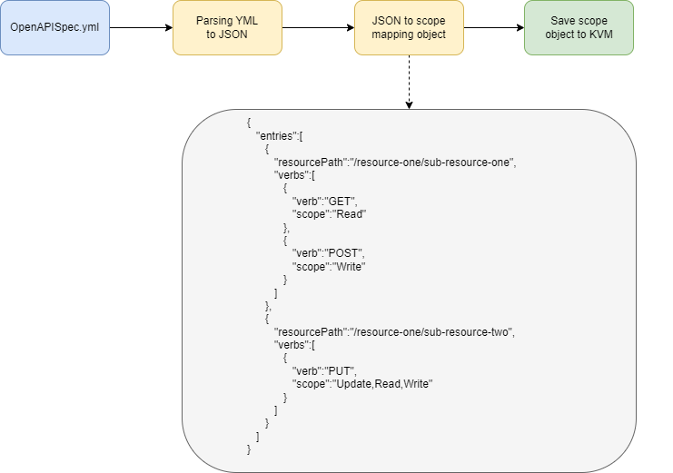

# Apigee Scope Validation using OpenAPI Specification

## Introduction

In API security and management, we often use a lot of different security mechanisms to protect the requested resource behind it. One of these mechanisms is the validation of scopes to authorize a client on a specific sub-resource of the API, most of the time will the required scopes for the used HTTP verb be defined inside an OpenAPI Specification also known as a Swagger File.

## OpenAPI Specification on Apigee

Inside an Apigee proxy, you can add an [OpenAPI Spec Validation policy](https://docs.apigee.com/api-platform/reference/policies/oas-validation-policy), which you can use to validate the incoming request’s message content and parameters such as query parameters, headers & cookies. Unfortunately, Apigee does not support the validation of required scopes specified inside of the uploaded OpenAPI Specification, resulting in a custom development.

## Content of this repository

The custom development is built out of two separate components, an external NodeJS script and a SharedFlow to bundle the Apigee policies used for this authorization mechanism.

### Schema of NodeJS script

### Schema of Apigee SharedFlow

## How to use this repository?

1. Clone thos repository

2. Zip the [sharedflowbundle](./sharedflowbundle/) and upload it to Apigee

3. Create the scope mapping using the [NodeJS Script](./NodeJS%20Script/)